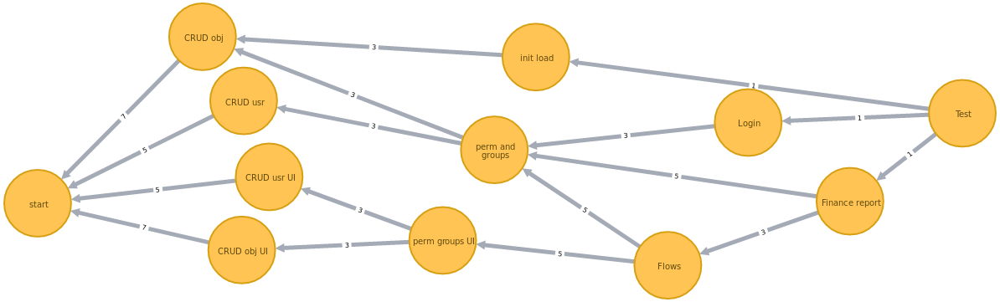

# Capacidad de equipos estimada

Propuesta para recolectar datos históricos sobre los proyectos que se han desarrollando para poder predecir cuantos recursos se necesitaran para futuros desarrollos de software.

El histórico que se planea obtener por cada proyecto es un mapa de actividades 
*Ejemplo de mapa de actividades de Apolo*

* Un nodo es una tarea del proyecto
* Existe una arista entre dos nodos si son tareas dependientes
* El peso de la arista son las unidades de tiempo que se estima que durará la tarea

## Propuesta de solución

1. Crear un histórico de los proyectos que se han terminado
2. Transformar los mapas de actividades a un dataset
3. Entrenar un modelo de Machine Learning

## Transformacion del dataset
Para transformar un mapa de activades a un vector dentro del dataset se hace con ayuda de Teoria de Graficas.
cada entrada del vector es una propiedad de la gráfica

Ejemplo del dataset:

|Nodos totales|Aristas totales|Diametro|max in deg|min in deg|max out deg|min out deg|Centralidad|Rango de Articulo|
|---|---|---|---|---|---|---|---|---|
|   |   |   |   |   |   |   |   |   |

**Nodos totales**: Número de nodos en la gráfica 
**Aristas totales**: Número de aristas en la gráfica 
**Diametro**: Maxima distancia entre dos nodos 
**Grado de entrada Máximo (max in deg)**: Número maximo de flechas que apuntan a un nodo 
**Grado de entrada Mínimo (min in deg)**: Número minimo de flechas que apuntan a un nodo 
**Grado de salida Máximo (max out deg)**: Número maximo de flechas que salen de un nodo 
**Grado de salida Mínimo (min out deg)**: Número minimo de flechas que salen de un nodo 
**Centralidad**: Metrica para saber que nodo es mas critico, ser critico significa que si se elimina la gráfica se divide en dos o mas partes 
**Rango de Articulo**: Metrica para saber que nodo es mas influyente, ser influyente significa que los demas nodos lo refieren a el 

## MVP
La implementación del MVP se hizo utilizando **Neo4j** 
Se implementaron las consultas para sacar las propiedades mencionadas
[Ejemplo de consultas](/queries.md)
